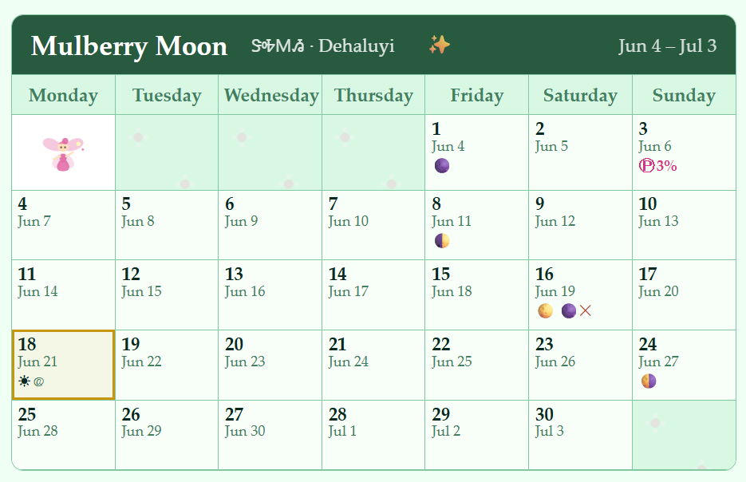
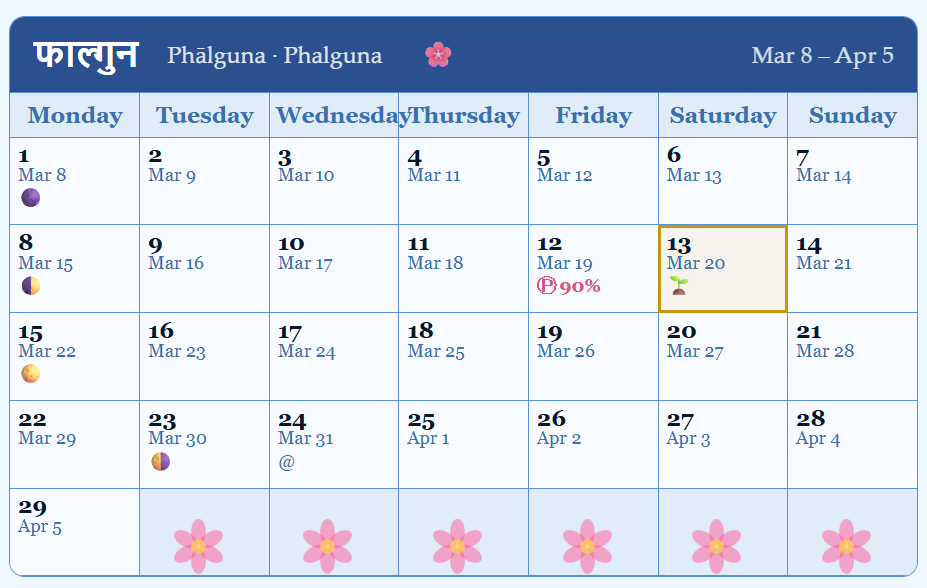
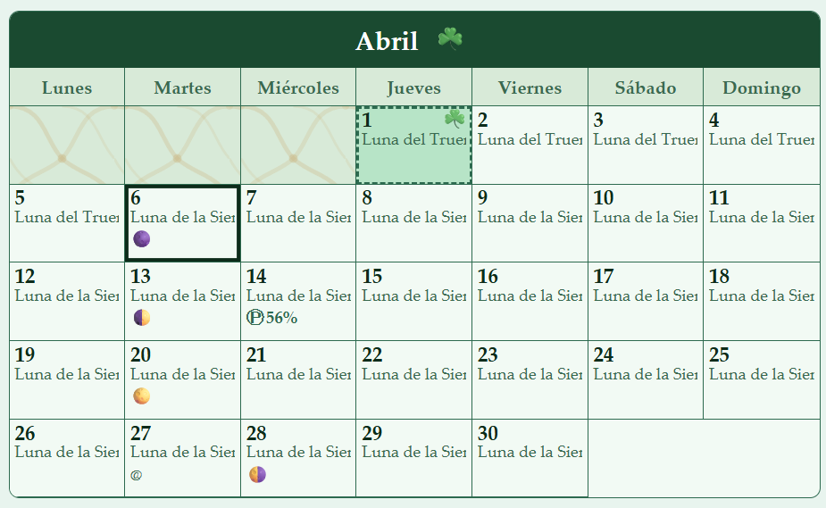
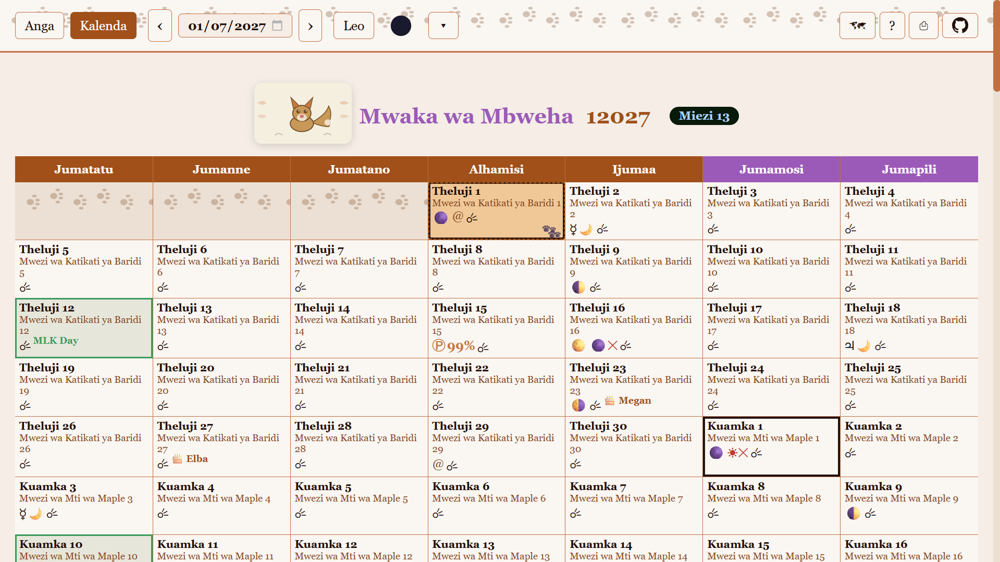
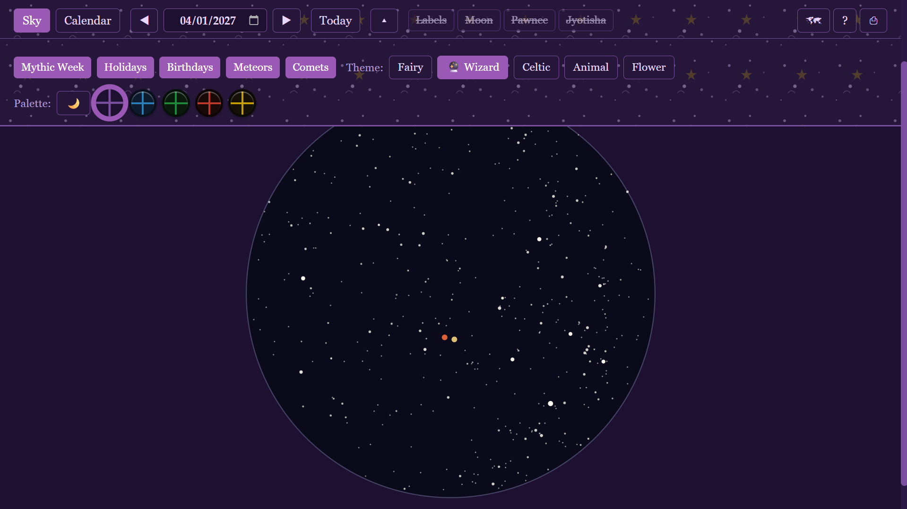
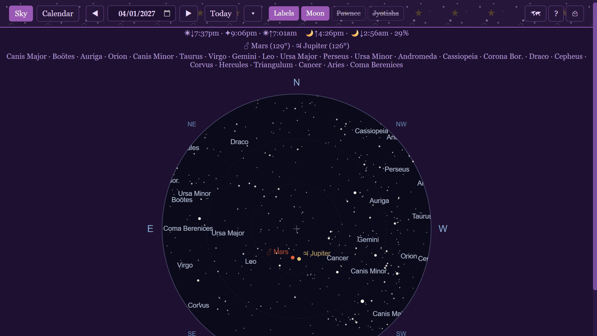
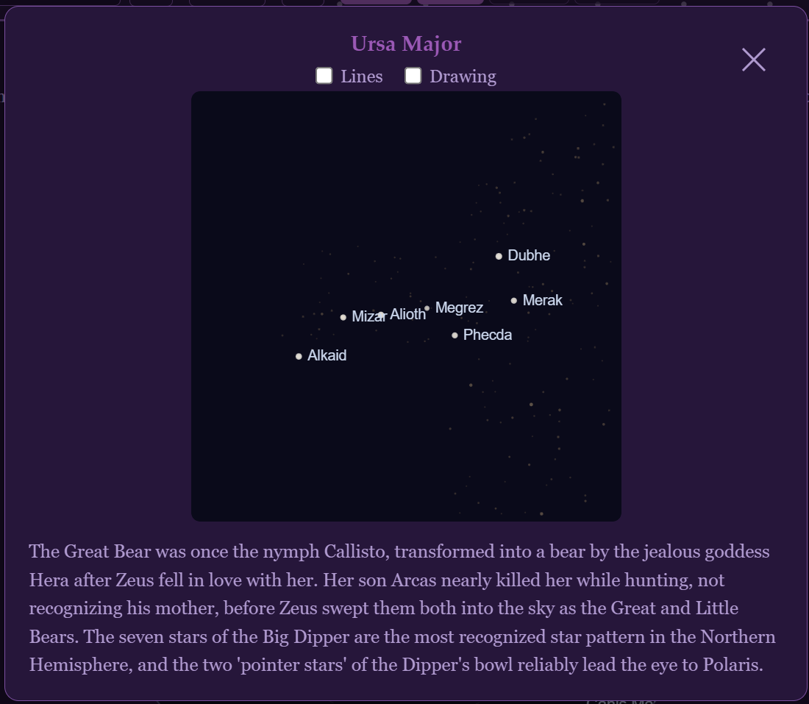
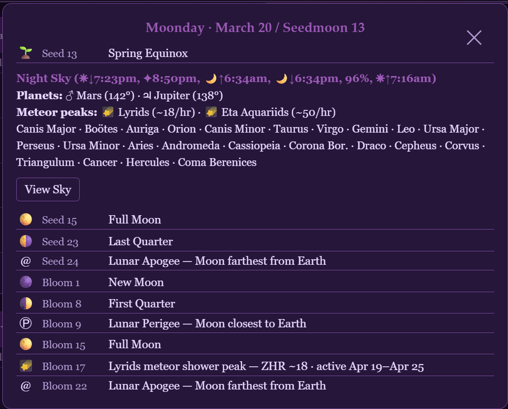
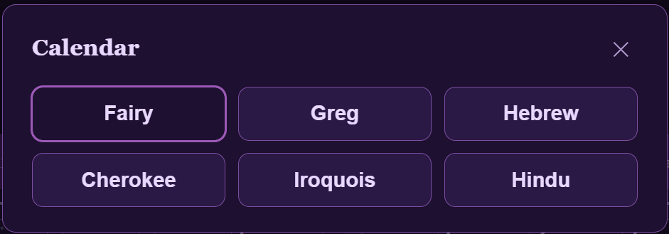
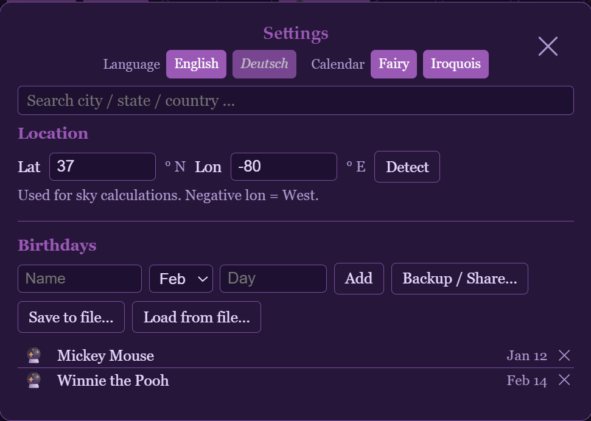

# Fairy Calendar

**A mythic lunar calendar for the Human Era** — track time by moonlight, navigate the night sky, and mark the turning of the year by solstice and season.

Built as a personal project for my wife and me. Pure vanilla HTML/CSS/JavaScript — no dependencies, no build step. Open `index.html` and it just works.

Please don't be dismayed by the custom month and weekday names. You can select the standard (Gregorian) calendar, or one of the other lunar calendars if you prefer.

---

## Screenshots

<table>
<tr>
<td valign="top" colspan="2">
<br>
<sub><b>Main toolbar</b> — Sky/Calendar toggles, reverse play / date picker / sky play, Today button, moon phase, show/hide collapsible toggle, settings, help, print</sub>
</td>
</tr>
<tr>
<td valign="top" colspan="2">
<br>
<sub><b>Collapsible toolbar</b> — Month/Week toggle · Mythic week toggle · Day-box content toggles (Holidays, Birthdays, Meteors, Comets) · Theme switcher (each theme has a unique icon: fairy, palantír, clover, footprints, flowers) · Palette: light/dark toggle + color picker</sub>
</td>
</tr>
<tr>
<td valign="top">
<br>
<sub><b>Cherokee calendar</b> — Tsalagi lunar months with syllabary names, Fairy theme</sub>
</td>
<td valign="top">
<br>
<sub><b>Hindu/Jyotisha calendar</b> — Devanagari month names, Flower theme</sub>
</td>
</tr>
<tr>
<td valign="top">
<br>
<sub><b>Gregorian calendar</b> — Spanish language, Celtic theme</sub>
</td>
<td valign="top">
<br>
<sub><b>Week view</b> — Kiswahili language, Gregorian primary with Iroquois secondary, Animal theme</sub>
</td>
</tr>
<tr>
<td valign="top">
<br>
<sub><b>Night sky</b> — full-screen star chart calculated for your location; all label overlays off</sub>
</td>
<td valign="top">
<br>
<sub><b>Sky with labels</b> — sun/moon rise/set and astronomical twilight times, visible constellation list with links, clickable view orientation (N, NW, W, etc.)</sub>
</td>
</tr>
<tr>
<td valign="top">
<br>
<sub><b>Constellation detail</b> — line/drawing toggles, labeled stars, faint real background stars, mythology</sub>
</td>
<td valign="top">
<br>
<sub><b>Day info panel</b> — notable icons explained, night sky times (sunset, astronomical twilight, moonrise, moonset, sunrise), planet positions, visible constellations, View Sky button, upcoming calendar events</sub>
</td>
</tr>
<tr>
<td valign="top">
<br>
<sub><b>Calendar picker</b> — toggle secondary calendars alongside the Fairy calendar</sub>
</td>
<td valign="top">
<br>
<sub><b>Settings</b> — location, language, birthdays, save/share birthdays using link or file</sub>
</td>
</tr>
</table>

---

## Features

**Calendar**
- Holocene (Human Era) year numbering — Gregorian year + 10,000 (2026 = Year 12026)
- 12 named lunar months beginning on each new moon: Snowmoon through Darkmoon
- Darkmoon (the moon holding the winter solstice) subdivided into five named parts: Robin, Rabbit, Turkey, Bear, Fox — which also names the year
- Bluemoon rule: a 13th moon is automatically intercalated when the solstice falls late in Darkmoon
- Month view, Week view, optional Gregorian date overlay
- Norse mythic weekday names: Heimday, Tyrsday, Wodensday, Thorsday, Freyasday, Moonday, Sunday

**Night Sky**
- Interactive star chart accurate to your location — zoom, pan, rotate by compass direction
- Star positions drawn from the **Gaia DR3** catalog — one of the most precise stellar surveys ever made
- Moon phase display with accurate position in sky
- Planetary positions and elongations
- Constellation art with star labels, mythology, and lore — 88 constellations with artwork from the [Stellarium](https://stellarium.org) project
- **Skidi Pawnee** sky culture constellation names (optional overlay) — a pre-Columbian tradition tied closely to the same stars
- **Hindu/Jyotisha** nakshatra overlay — the 27-division lunar mansion system used in Vedic astronomy
- Rise/set times for sun and moon, astronomical twilight

**Astronomical Events**
- Solstices and equinoxes
- Lunar and solar eclipses
- Meteor shower peaks with zenithal hourly rate (ZHR)
- Visible comet windows with brightness estimates
- Planetary conjunctions and notable close approaches

**Other Calendars**
- primary calendar determines calendar structure
- secondary calendar month name and day number appear in day boxes
- Hebrew, Cherokee, Iroquois, Hindu/Jyotisha
- Gregorian

**Languages**
- Display the calendar in 8 languages: English, Deutsch, Français, Italiano, Español, Kiswahili, Latina, संस्कृतम्
- Optional secondary language overlay — appears in tooltips

**Location**
- Browser geolocation ("find my city") for sky calculations
- Searchable city database (10,000+ cities with timezone support)

**Themes & Appearance**
- 5 themes: Fairy, Wizard, Celtic, Animal, Flower
- 5 color variants per theme
- Light/dark mode
- Instant theme switching — no re-render

**Technical**
- Pure vanilla HTML/CSS/JavaScript — zero dependencies
- Works via `file://` or any HTTP server
- PWA-ready (installable on desktop and mobile)
- All settings and birthdays stored in `localStorage`

---

## Running

```bash
python -m http.server 8000
# open http://localhost:8000
```

Or just open `index.html` directly in your browser — `file://` works fine.

---

## The Calendar System

The Fairy Calendar counts years from the beginning of the Human Era — add 10,000 to the Gregorian year (so 2026 is Year **12026**). Each month begins on a new moon, giving 12 months in most years. The final month, **Darkmoon**, holds the winter solstice and is divided into five named periods (Robin, Rabbit, Turkey, Bear, Fox); whichever period the solstice falls in names the year. When the solstice falls late enough in Darkmoon, a **Bluemoon** is inserted after it, creating a 13-month year.

Weeks run Heimday through Sunday — the familiar seven days, with Norse mythological names restored.

**→ See [help.md](help.md) for the full calendar guide**: moon names and meanings, Bluemoon intercalation rules, year animal table, weekday mythology, icons legend, and multi-calendar comparisons. This is the in-app help which is also translated into the primary language.

---

## File Structure

```
fairy/
├── index.html          # UI shell and toolbar
├── app.js              # Core application logic and state
├── render.js           # Calendar and sky view rendering
├── style.css           # All styling (CSS custom properties for theming)
├── themes.js           # Theme definitions, SVG patterns, color palettes
├── astro.js            # Astronomical engine (lunar phases, eclipses, planets)
├── calendar.js         # Fairy calendar builder (lunar month sequencing)
├── i18n.js             # Internationalization strings
├── stars.js            # Star catalog (Gaia DR3 data)
├── cities.js           # City database with coordinates and timezones
├── constellations/     # 88 constellation artwork PNGs
├── help.md             # Full user guide
├── birthdays.js        # Personal birthdays (localStorage-backed)
├── comets.js           # Comet visibility data
└── holidays.js         # US federal holidays
```

---

## Themes

| Theme | Description |
|-------|-------------|
| **Fairy** | Pastel and magical, with fairy wing decorations |
| **Wizard** | Deep and arcane — the dark mode theme |
| **Celtic** | Earthy greens and cream with knotwork patterns |
| **Animal** | Warm nature tones with rotating year-animal art |
| **Flower** | Botanical, with seasonal plant and flower motifs |

Each theme has five color variants (a–e) switchable instantly from the toolbar.
